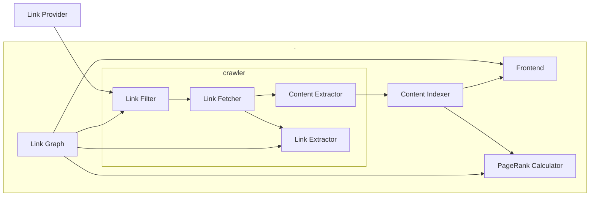

# Links-R-Us-2
\*This project is based on the book [Hands-On Software Engineering with Golang](https://www.packtpub.com/product/hands-on-software-engineering-with-golang/9781838554491)

Link-R-Us is a search engine.
It will allows users to submit URLs. The search engine will crawl these links, index their content and add any newly encountered links to its database for further crawling.

The search engine implementation is based on PageRank algorithim based on the paper titled <i><b>The PageRank Citation Ranking: Bringing Order to the Web</b></i> by <cite>[Larry Page, Sergey Brin, Rajeev Motwani, and Terry Winograd][1]</cite>

The search engine consists of the following components: -
- Crawler
    - Link Filter
    - Link Fetcher
    - Content Extractor
    - Link Extractor
- Content Indexer
- Page Rank Calculator
- Link Graph
- Link Provider
- Frontend

# SLA
|Metric                                             |Expectation                      |Measurement Period | Notes|
|------                                             |-----------                      |-------------------|------|
|Links 'R' Us availability                          |99% uptime                       |Yearly             |Tolerates up to 3d 15h 39m of downtime per year|
|Index service availability                         |99.9% uptime                     |Yearly             |Tolerates up to 8h 45m of downtime per year|
|PageRank calculator service availability           |70% uptime                       |Yearly             |Not a user-facing component of our system. Therefore, the service can endure longer periods of downtime|
|Search response time                               |30% of requests answered in 0.5s | Monthly           |-|
|Search response time                               |70% of requests answered in 1.2s |Monthly            |-|
|Search response time                               |99% of requests answered in 2.0s |Monthly            |-|
|CPU utilization for the PageRank calculator service|90%                              |Weekly             |We shouldn't be paying for idle computing nodes|
|SRE team incident response time                    |90% of tickets resolved within 8h|Monthly            |-|

# UML
located page 170

[1]: http://ilpubs.stanford.edu:8090/422/
